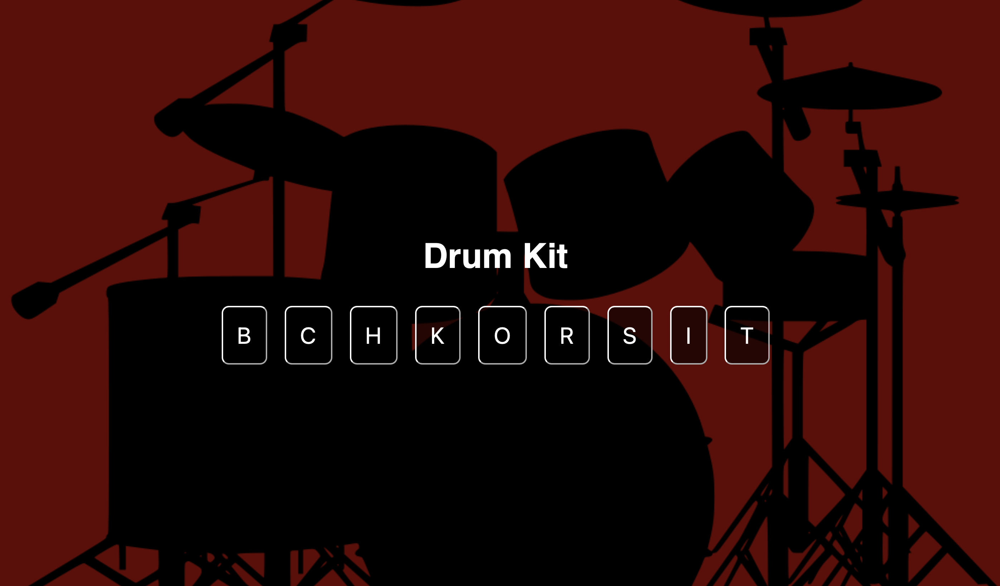

# 🥁 Drum Kit Web Application

This is an interactive **Drum Kit** web application built using basic HTML, CSS, and JavaScript. Users can play different drum sounds by either clicking the buttons or pressing the corresponding keyboard keys.

## 🚀 Features

- Play drum sounds by clicking
- Keyboard interaction
- Unique button animations for each sound

## 🎮 Key Mappings

| Key | Sound   |
| --- | ------- |
| B   | Boom    |
| C   | Clap    |
| H   | HiHat   |
| K   | Kick    |
| O   | OpenHat |
| R   | Ride    |
| S   | Snare   |
| I   | Tink    |
| T   | Tom     |

## 📷 Screenshot



## 🛠️ Technologies Used

- HTML5
- CSS3
- JavaScript (Vanilla JS)

## 💡 How to Use

1. Clone the repository:
   ```bash
   git clone https://github.com/your-username/drum-kit.git
   cd drum-kit
   ```
2. Open the `index.html `file in your browser.
